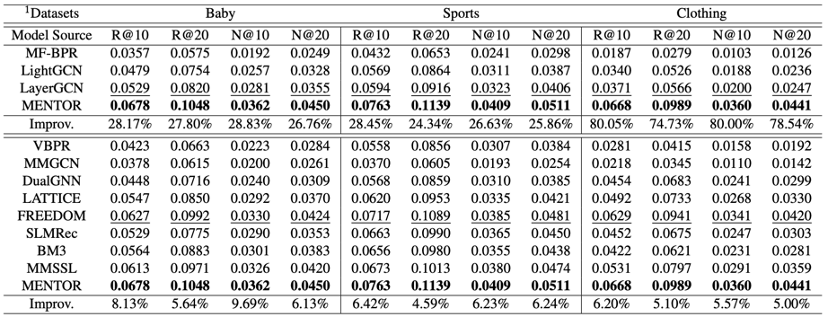

# MENTOR: Multi-level Self-supervised Learning for Multimodal Recommendation

<!-- PROJECT LOGO -->

## Introduction

This is the Pytorch implementation for our MENTOR paper:

>MENTOR: Multi-level Self-supervised Learning for Multimodal Recommendation

## Environment Requirement
- python 3.9
- Pytorch 2.1.0

## Dataset

We provide three processed datasets: Baby, Sports, Clothing.

Download from Google Drive: [Baby/Sports/Clothing](https://drive.google.com/drive/folders/1tU4IxYbLXMkp_DbIOPGvCry16uPvolLk)

## Training
  ```
  cd ./src
  python main.py
  ```
## Performance Comparison


## Citing MENTOR
If you find MENTOR useful in your research, please consider citing our [paper](https://arxiv.org/abs/2402.19407).
```
@article{xu2024mentor,
  title={MENTOR: Multi-level Self-supervised Learning for Multimodal Recommendation},
  author={Xu, Jinfeng and Chen, Zheyu and Yang, Shuo and Li, Jinze and Wang, Hewei and Ngai, Edith C-H},
  journal={arXiv preprint arXiv:2402.19407},
  year={2024}
}
```
The code is released for academic research use only. For commercial use, please contact [Jinfeng Xu](jinfeng.xu0605@gmail.com).


## Acknowledgement
The structure of this code is  based on [MMRec](https://github.com/enoche/MMRec). Thank for their work.